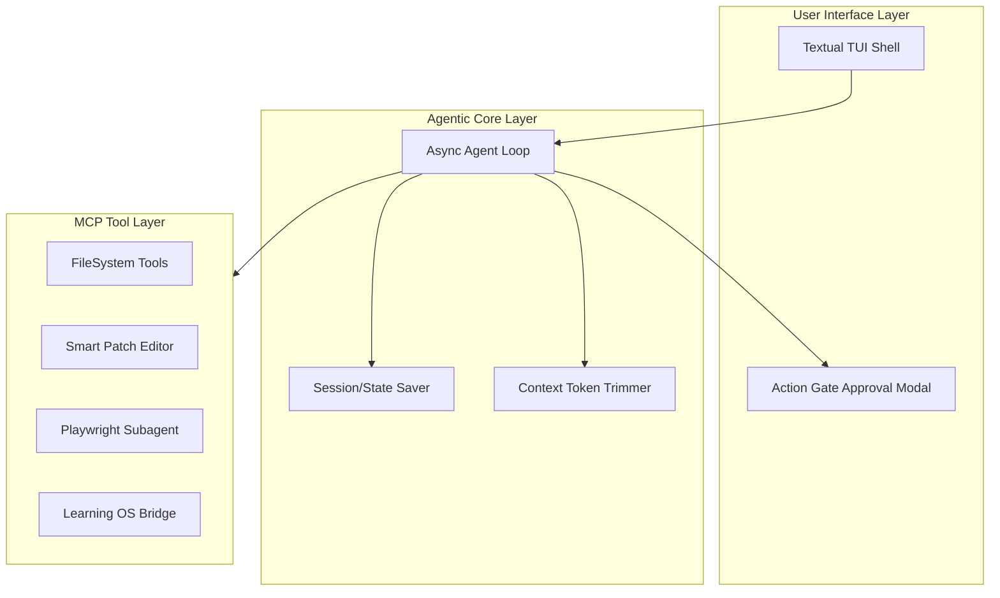
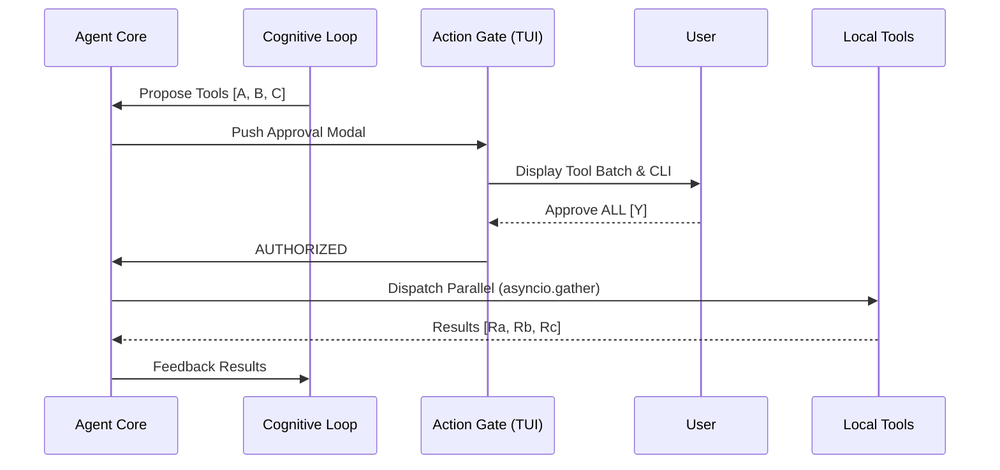

# 🔱 Titan Gateway: Architecture & Cognitive Loop

Titan Gateway is the sovereign agentic hub that powers your Neovim AI interactions. It serves as a high-fidelity portal between external LLMs and your local Linux environment, governed by a strict **Action Gate** security model.

---

## 1. High-Level Architecture

Titan is organized into three distinct layers: the **User Interface Layer**, the **Agentic Core Layer**, and the **MCP Tool Layer**.

---

## 2. The Cognitive Loop & Action Gate

The Core Loop follows a "Reason -> Propose -> Approve -> Execute" cycle. No system mutation (file edit, command execution) happens without your explicit consent in the Action Gate.

### Key Features of the Loop:
- **Parallel Dispatch**: Approved tool calls are executed concurrently using `asyncio.gather`, minimizing latency.
- **Iterative Self-Correction**: If a tool fails, the agent analyzes the error and automatically retries with a refined strategy (up to 3 times).
- **Deep Sovereignty**: Support for mid-session hot-swapping between provider tiers (Gemini, Groq, Ollama) directly from the TUI.

---

## 3. Neovim Integration

Your Neovim configuration interacts with Titan Gateway through two primary channels:

1.  **`avante.nvim`**: Acts as the "AI Brain" within the editor, connecting to the Titan Gateway API (`http://localhost:4000/v1`).
2.  **`mcphub.nvim`**: Provides the "Model Context Protocol" (MCP) bridge, allowing the AI to access local tools and project context.

> [!TIP]
> You can view these diagrams anytime from within Neovim by opening this file and pressing `<leader>dv` (Diagram View).
